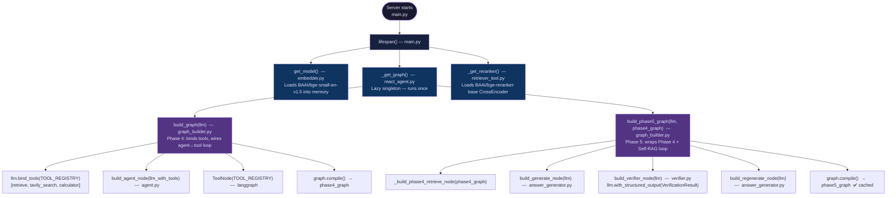
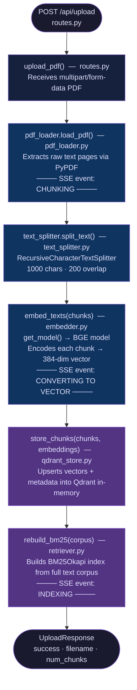
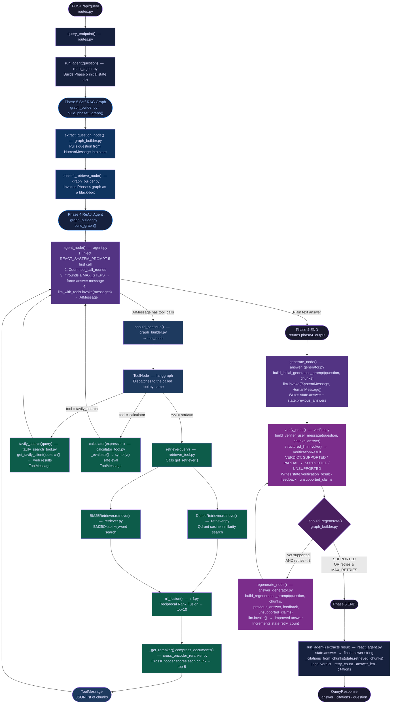

# ResearchAI — Document Q&A Assistant

A Self-RAG research assistant that lets you upload PDF papers and ask natural language questions. Answers are **grounded in your documents with source citations**, powered by a **LangGraph Phase 5 Self-RAG pipeline** — hybrid search (dense + BM25 + RRF) → Cross-Encoder re-rank → answer generation → Self-RAG verification loop → regeneration if needed. LLM: **Groq `qwen/qwen3-32b`**.

---

## Tech Stack

| Component | Technology |
|---|---|
| Backend | FastAPI + Python ≥ 3.10 |
| Vector DB | Qdrant (in-memory) |
| Embeddings | BAAI/bge-small-en-v1.5 (384-dim) |
| Sparse Retrieval | BM25 (rank-bm25) |
| Rank Fusion | Reciprocal Rank Fusion (RRF) |
| Re-ranking | BAAI/bge-reranker-base (Cross-Encoder) |
| Agent Framework | LangGraph (ReAct loop, up to 3 tool calls) |
| Self-RAG Verifier | LangGraph Phase 5 (verify → regenerate loop, up to 3 retries) |
| LLM | Groq `qwen/qwen3-32b` (via LangChain ChatGroq) |
| Agent Tools | `retrieve` · `tavily_search` · `calculator` |
| Chunking | RecursiveCharacterTextSplitter (1000 chars / 200 overlap) |
| Frontend | HTML + Vanilla CSS + Vanilla JS |

---

## Project Structure

```
Research tool/
├── README.md
├── .gitignore
│
├── backend/                                    ← Python FastAPI server
│   ├── .env                                    ← API keys (not committed)
│   ├── main.py                                 ← FastAPI entry point & lifespan startup
│   ├── pyproject.toml                          ← Project metadata & dependencies
│   ├── uv.lock                                 ← uv lockfile
│   └── app/
│       ├── api/
│       │   └── routes.py                       ← /upload, /query, /health endpoints
│       ├── chunkers/
│       │   └── text_splitter.py                ← RecursiveCharacterTextSplitter wrapper
│       ├── embeddings/
│       │   └── embedder.py                     ← BGE embedding model (lazy singleton)
│       ├── llm/
│       │   └── gemini.py                       ← Groq ChatGroq client wrapper
│       ├── loaders/
│       │   └── pdf_loader.py                   ← PDF text extraction via PyPDF
│       ├── models/
│       │   └── schemas.py                      ← Pydantic request/response schemas
│       ├── tools/                              ← Agent tool implementations
│       │   ├── calculator_tool.py              ← Safe SymPy math evaluator
│       │   └── tavily_search_tool.py           ← Tavily web search tool
│       ├── retrievers/
│       │   ├── retriever.py                    ← Dense + BM25 + RRF pipeline; rebuild_bm25()
│       │   ├── bm25_retriever.py               ← BM25 sparse retriever (rank-bm25)
│       │   ├── rrf.py                          ← Reciprocal Rank Fusion combiner
│       │   ├── cross_encoder_reranker.py       ← BAAI/bge-reranker-base Cross-Encoder
│       │   ├── graph_builder.py                ← Phase 4 + Phase 5 LangGraph assembly
│       │   ├── self_verfier/                   ← Phase 5 Self-RAG verification package
│       │   │   ├── agent_state.py              ← Phase 5 AgentState TypedDict
│       │   │   ├── schemas.py                  ← VerificationResult + Verdict enum
│       │   │   ├── answer_generator.py         ← generate_node + regenerate_node factories
│       │   │   ├── generation_prompt.py        ← Generation & regeneration prompts
│       │   │   ├── verifier.py                 ← verify_node factory (structured LLM output)
│       │   │   └── verifier_prompt.py          ← Verifier system & user prompts
│       │   └── retriver_agent/                 ← Phase 4 ReAct agent package
│       │       ├── agent.py                    ← AgentState + REACT_SYSTEM_PROMPT + build_agent_node()
│       │       ├── retriever_tool.py           ← @tool: Dense→BM25→RRF→CrossEncoder + TOOL_REGISTRY
│       │       └── react_agent.py              ← Public API: run_agent(question)
│       ├── utils/
│       └── vectordb/
│           └── qdrant_store.py                 ← Qdrant in-memory vector store
│
├── frontend/                                   ← Static single-page UI
│   ├── index.html                              ← App shell & markup
│   ├── style.css                               ← Dark-mode styles & layout
│   └── app.js                                  ← Upload pipeline animation, chat, citations
│
└── files/                                      ← Reference documents
    ├── Product Requirement Document.pdf
    └── Technical Requirement Document.pdf
```

---

## Setup & Run

### Prerequisites

- Python ≥ 3.10
- [uv](https://github.com/astral-sh/uv) (recommended) **or** pip
- A [Groq API key](https://console.groq.com/)
- A [Tavily API key](https://app.tavily.com/) (for web search tool)

### 1. Clone the repository

```bash
git clone https://github.com/vanshpx/Research-app.git
cd "Research tool"
```

### 2. Add your API keys

Create `backend/.env`:
```env
GROQ_API_KEY=your_groq_key_here
TAVILY_API_KEY=your_tavily_key_here
```

### 3. Install dependencies

**With uv (recommended):**
```powershell
cd backend
uv sync
.venv\Scripts\activate
```

**With pip:**
```powershell
cd backend
python -m venv .venv
.venv\Scripts\activate
pip install -r requirements.txt
```

### 4. Start the server

```powershell
uv run main.py
```

| URL | Description |
|---|---|
| http://localhost:8000/ | Frontend UI (served automatically) |
| http://localhost:8000/docs | Swagger / OpenAPI UI |
| http://localhost:8000/api/health | Health check + chunks indexed count |

---

## Complete Call-Flow Diagram

The diagram below shows **every function call, in order, from every module** — for both the PDF upload path and the query path.

### Server Startup



---

### PDF Upload Flow



---

### Query Flow — Full End-to-End



---

## How It Works

### Upload flow

```
PDF file
  → pdf_loader.load_pdf()   — extract raw text pages (PyPDF)
  → text_splitter.split()   — chunk into 1000-char segments (200 overlap)
  → embedder.embed_texts()  — encode each chunk → 384-dim BGE vector
  → qdrant_store.store()    — upsert vectors + metadata into Qdrant
  → retriever.rebuild_bm25() — rebuild BM25 index from full corpus
```

The frontend shows a **3-stage pipeline animation** during upload:
`CHUNKING → CONVERTING TO VECTOR → INDEXING`

### Query flow (summary)

```
User question
  ─── Phase 4: ReAct Retrieval (up to 3 tool rounds) ────────────────
  │   agent_node  →  [retrieve | tavily_search | calculator]  →  loop
  │        retrieve: Dense (Qdrant) + BM25 + RRF → CrossEncoder top-5
  │        tavily_search: live web results
  │        calculator: safe SymPy math evaluation
  │
  ─── Phase 5: Self-RAG Verification (up to 3 retries) ──────────────
  │   generate_node   →  first answer from retrieved chunks
  │   verify_node     →  SUPPORTED / PARTIALLY_SUPPORTED / UNSUPPORTED
  │   regenerate_node →  rewrite using verifier feedback  (if needed)
  │   loop back to verify_node until SUPPORTED or max retries
  │
  → answer + source citations returned to frontend
```

### Agent tools

| Tool | Module | When the agent uses it |
|---|---|---|
| `retrieve` | `retriever_tool.py` | Questions about uploaded PDFs (dense + BM25 + RRF + CrossEncoder) |
| `tavily_search` | `tools/tavily_search_tool.py` | Recent events, live data, anything outside the corpus |
| `calculator` | `tools/calculator_tool.py` | Any arithmetic, statistics, or algebraic computation |

### Startup pre-loading

On server start, three heavy resources are pre-loaded before the first request:

| # | Resource | Module | Why eager |
|---|---|---|---|
| 1 | BGE embedding model | `embedder.py` | Needed on every upload & query |
| 2 | Phase 4 + Phase 5 compiled graphs + Groq LLM | `react_agent.py` | Graph compilation has overhead |
| 3 | CrossEncoder (bge-reranker-base) | `retriever_tool.py` | ~440 MB model load takes 2–5 s |

BM25 index is **not** pre-loaded — it is rebuilt immediately after each PDF upload since it depends on the corpus.

---

## API Endpoints

### `POST /api/upload`
Upload a PDF file for indexing.

**Request:** `multipart/form-data` with a `file` field

**Response:**
```json
{
  "success": true,
  "message": "Successfully processed 'paper.pdf'.",
  "filename": "paper.pdf",
  "num_chunks": 42
}
```

---

### `POST /api/query`
Ask a question about uploaded documents.

**Request:**
```json
{ "question": "What is the main contribution?", "top_k": 5 }
```

**Response:**
```json
{
  "answer": "The main contribution is...",
  "citations": [
    { "source": "paper.pdf", "page": 3, "snippet": "..." }
  ],
  "retrieval_steps": 0,
  "question": "What is the main contribution?"
}
```

---

### `GET /api/health`
Returns server status and the total number of indexed chunks.

```json
{ "status": "ok", "documents_indexed": 106 }
```

---

## Environment Variables

| Variable | Required | Description |
|---|---|---|
| `GROQ_API_KEY` | ✅ Yes | Groq API key from [console.groq.com](https://console.groq.com/) |
| `TAVILY_API_KEY` | ✅ Yes | Tavily key from [app.tavily.com](https://app.tavily.com/) |
| `QDRANT_HOST` | ❌ No | Qdrant host (defaults to in-memory mode) |
| `QDRANT_PORT` | ❌ No | Qdrant port (default: 6333) |

---

## Model Cache Behaviour

| Resource | Cached where | Rebuilt when |
|---|---|---|
| BGE embedding model | `embedder.py` module global | Never (process lifetime) |
| Phase 4 compiled graph | `react_agent._graph` (via Phase 5) | Never |
| Phase 5 compiled graph | `react_agent._graph` | Never |
| CrossEncoder model | `retriever_tool._reranker` | Never |
| Qdrant client | `qdrant_store._client` | Never |
| BM25 index | `retriever._bm25_cache` | Every PDF upload |
| Qdrant vector data | In-memory only | Lost on server restart |

---

## Notes

- **Qdrant is in-memory** — all uploaded documents are lost when the server restarts. Re-upload your PDFs after each restart.
- The **CrossEncoder re-ranker** scores every (query, chunk) pair independently, which is slower than a bi-encoder but significantly more accurate for relevance ranking.
- **MAX_STEPS = 3** — the agent can call tools up to 3 times per query. After that it is forced to produce a final answer from what it already collected. Adjustable in `agent.py`.
- **MAX_RETRIES = 3** — the Self-RAG verifier will attempt up to 3 regeneration cycles. Adjustable in `graph_builder.py`.
- The **`qwen/qwen3-32b`** model runs with `reasoning_effort="none"` to disable the thinking chain, ensuring reliable tool-call responses from LangGraph's ToolNode.
